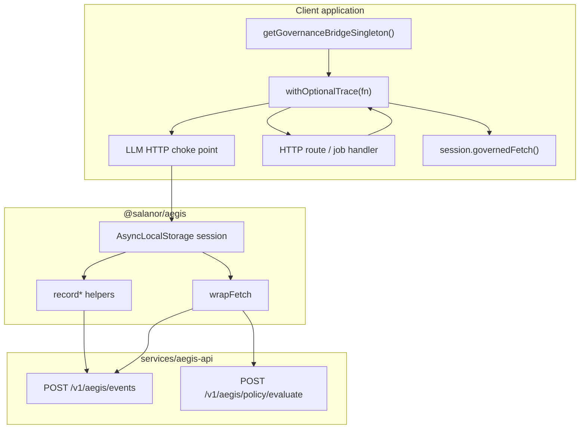

# Aegis Governance Bridge — MVP spec

**Status:** MVP in progress  
**SDK:** `@salanor/aegis` → `sdks/typescript/src/bridge.ts`  
**Audience:** Any client platform integrating Aegis (Node.js / TypeScript first)

---

## 1. Problem

Today, Aegis governance is **correct but manual**. Integrators must:

1. Create a `RecordContext` and signing credentials
2. Call `recordTraceStart` at the beginning of each workflow
3. Call `recordLlmInvocation` after every LLM call
4. Wrap outbound HTTP tools with `wrapFetch`
5. Close the trace with `recordProvenanceClaim`

That works for pilots (`apps/pilot-agent`) but is too heavy for product teams who want **one initialization** and automatic recording at framework boundaries.

The **Governance Bridge** is the productized layer on top of the existing SDK: same APS-1 events, same `POST /v1/aegis/events` ingest, same policy engine — but with a single `init()` + `withTrace()` pattern.

**Important:** Aegis is a **standalone product**. Client applications either:

1. Install `@salanor/aegis` (in-app SDK), or  
2. Use **Workflow Bridge** HTTP APIs from n8n/Zapier (server-signed — see `docs/AEGIS_N8N_INTEGRATION.md`)

No client-specific code belongs in the Salanor monorepo beyond generic examples and documentation.

---

## 2. MVP goals

| Goal | Success metric |
|------|----------------|
| **Attach once** | One env block + `getGovernanceBridgeSingleton()` at app bootstrap |
| **Trace boundaries** | `withTrace()` / `withOptionalTrace()` open and close signed traces |
| **LLM choke point** | Client wraps provider HTTP at one module; records when inside a trace |
| **Tool governance** | `session.governedFetch()` delegates to existing `wrapFetch` |
| **HTTP API audit** | Route handlers produce console-visible traces |
| **Orchestrator correlation** | Optional `X-Aegis-Trace-Id` response header for n8n / Zapier |
| **No passive intercept** | No sidecar, no universal traffic capture (deferred) |

**Out of scope for MVP:**

- LangGraph / CrewAI / MCP auto-plugins
- Global `fetch` monkey-patch (optional flag in P6.1)
- Python HTTP wrap (use `enforce_tool_policy` + manual record)
- Consolidating legacy `/api/aegis/ingest` (APS 0.1)
- Client-specific logic in Salanor repos

---

## 3. Architecture



---

## 4. SDK surface

### 4.1 Configuration

```typescript
type GovernanceBridgeConfig = {
  apiBaseUrl: string;           // AEGIS_API_URL
  ingestApiKey: string;         // AEGIS_INGEST_API_KEY
  organizationId: string;       // AEGIS_ORGANIZATION_ID
  agentId: string;              // AEGIS_AGENT_ID
  keyId: string;                // AEGIS_KEY_ID
  privateKeyB64: string;        // AEGIS_SIGNING_PRIVATE_KEY_B64
  actorPrincipal: string;       // AEGIS_ACTOR_PRINCIPAL (default: agent:<agentId>)
};
```

Env bootstrap (disabled unless `AEGIS_ENABLED=1` or `true`):

```typescript
import { getGovernanceBridgeSingleton, withOptionalTrace } from "@salanor/aegis";

const bridge = getGovernanceBridgeSingleton(process.env);
```

### 4.2 Route / job boundary

```typescript
const { result, traceId, traceUrl } = await withOptionalTrace(
  bridge,
  {
    triggerSource: "http_api",
    triggerDetail: "POST /api/v1/content/apply",
    businessContext: "CMS update from automation",
  },
  async (session) => {
    if (session) {
      await session.recordDataAccess({
        operation: "write",
        resource: "cms_content",
        fields: ["home", "services"],
      });
    }
    const outcome = await applyUpdates();
    if (session) {
      await session.recordDecision({
        decision: outcome.status,
        rationale: `Applied ${outcome.count} update(s).`,
      });
    }
    return outcome;
  },
  { consoleUrl: process.env.AEGIS_CONSOLE_URL },
);

// Return traceId in X-Aegis-Trace-Id for orchestrators
```

Inside `withTrace`, `getActiveGovernanceSession()` returns the active session (used by LLM wrappers).

### 4.3 Enterprise helpers

| Export | Purpose |
|--------|---------|
| `safeGovernance()` | Fail-open recording — never break primary flow |
| `withOptionalTrace()` | Trace when configured; no-op when disabled |
| `AEGIS_TRACE_ID_HEADER` | Standard response header for correlation |
| `buildAegisTraceUrl()` | Console deep-link for ops logs |

### 4.4 Event types recorded

| Boundary | `action_kind` | When |
|----------|---------------|------|
| Trace open | `tool_call` (`aegis.trace.start`) | `session.start()` |
| LLM call | `llm_invocation` | After successful LLM HTTP response |
| Data access | `data_access` | Explicit `recordDataAccess()` |
| Decision | `decision` | Explicit `recordDecision()` |
| Tool call | `policy_decision` + `result` | `governedFetch()` / `wrapFetch` |
| Trace close | `provenance_claim` | `session.close()` |

All events are **Ed25519 signed** and ingested via `POST /v1/aegis/events`.

---

## 5. Salanor repo mapping

| Area | Path | MVP action |
|------|------|------------|
| Bridge module | `sdks/typescript/src/bridge.ts` | `GovernanceBridge`, helpers, singleton |
| SDK export | `sdks/typescript/src/index.ts` | Public API |
| Reference agent | `apps/pilot-agent/src/governance.ts` | Migrate to bridge in P6.1 |
| Example | `examples/governance-bridge-node/` | Generic partner sample |
| n8n guide | `docs/AEGIS_N8N_INTEGRATION.md` | Orchestrator patterns (any client) |
| Ingest API | `services/aegis-api/src/routes/events.ts` | No change |
| Console | `apps/web-console/src/app/aegis/traces/` | Traces appear automatically |

---

## 6. Client integration pattern (any platform)

Each client owns its integration code. Typical layout:

```
your-app/
  src/lib/governance/
    bridge.ts          # getGovernanceBridgeSingleton() wrapper (optional)
    llm-instrument.ts  # Provider HTTP choke point
  src/app/api/...      # withOptionalTrace at route boundaries
```

Steps:

1. `pnpm add @salanor/aegis` (or link locally during development)
2. Provision org, agent, ingest key, signing key in Aegis Console
3. Set `AEGIS_*` env vars on the server (never `NEXT_PUBLIC_*` for secrets)
4. Wrap **one** LLM HTTP module and **HTTP routes / jobs** that mutate state
5. Return `X-Aegis-Trace-Id` on responses when tracing is active

See `examples/governance-bridge-node/` and `docs/AEGIS_N8N_INTEGRATION.md`.

---

## 7. Environment variables (standard contract)

```bash
# Off by default — zero overhead when unset or AEGIS_ENABLED=0
AEGIS_ENABLED=0
AEGIS_API_URL=https://aegis-api.example.com
AEGIS_INGEST_API_KEY=
AEGIS_ORGANIZATION_ID=
AEGIS_AGENT_ID=
AEGIS_KEY_ID=
AEGIS_SIGNING_PRIVATE_KEY_B64=
AEGIS_ACTOR_PRINCIPAL=agent:your-agent-id
AEGIS_CONSOLE_URL=https://console.example.com
```

Provision credentials: Aegis Console → Settings → API keys → Create ingest key. Signing key shown once at agent provisioning.

---

## 8. Implementation checklist

### Phase A — SDK (salanor)

- [x] `GovernanceBridge` + `GovernanceSession`
- [x] `getActiveGovernanceSession()` via AsyncLocalStorage
- [x] `safeGovernance`, `withOptionalTrace`, singleton, trace URL helpers
- [x] Export from `sdks/typescript/src/index.ts`
- [x] `pnpm --filter @salanor/aegis build`
- [ ] Unit test: session lifecycle (start → record → close)
- [ ] Update `apps/web-docs` getting-started with Bridge section

### Phase B — Generic examples & docs

- [x] `examples/governance-bridge-node/`
- [x] `docs/AEGIS_N8N_INTEGRATION.md`
- [ ] `pnpm sdk:conformance` still passes

### Phase C — Client integrations (outside Salanor repo)

Each customer integrates `@salanor/aegis` in **their** application. Salanor does not ship customer-specific code.

- [ ] Customer enables `AEGIS_*` on their server
- [ ] Customer wraps HTTP routes / jobs with `withOptionalTrace`
- [ ] Customer instruments LLM HTTP choke point
- [ ] Orchestrator reads `governance.traceId` from API responses

### Phase D — Deferred

- [ ] Global `fetch` patch behind `AEGIS_GOVERN_FETCH=1`
- [ ] Python `GovernanceBridge` class
- [ ] n8n community node / certified template pack
- [ ] Migrate `pilot-agent` to use `GovernanceBridge`

---

## 9. Acceptance criteria

1. **One-time setup:** Client ops sets env vars; no code fork of Aegis required.
2. **LLM calls** inside an active trace produce `llm_invocation` events.
3. **HTTP mutations** produce traces with data access + decision events.
4. **Console** shows trace at `/aegis/traces/:traceId`.
5. **Disabled by default:** `AEGIS_ENABLED=0` → zero SDK calls.
6. **Fail-open:** `safeGovernance` — recording errors never break user flows.
7. **No client coupling:** Salanor repo contains zero references to specific customer codebases.

---

## 10. Security notes

- Signing private key stays server-side only (never `NEXT_PUBLIC_*`).
- Ingest API key is Bearer secret; rotate via console.
- Bridge does **not** bypass server-side policy re-evaluation on ingest.
- LLM previews are truncated (160 chars) — avoid full PII in `businessContext`.

---

## 11. Related docs

- `docs/AEGIS_N8N_INTEGRATION.md` — workflow orchestration patterns
- `docs/AEGIS_PHASE_2.md` — cloud ingest infrastructure
- `docs/AEGIS_POLICY_V1.md` — policy rules for tool gating
- `docs/E2E_PARTNER_ONBOARDING.md` — key provisioning
